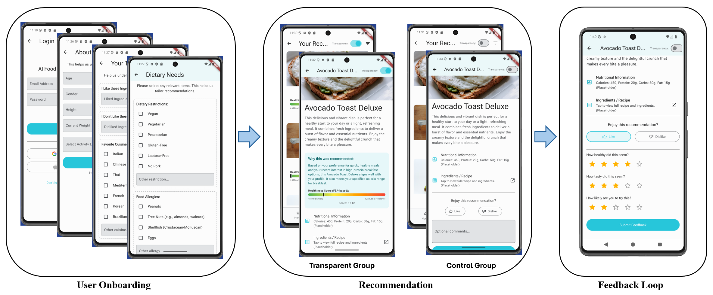

# NutriRecom - AI Food App Frontend

This repository contains the official frontend (UI) for the **NutriRecom** project, an AI-powered food recommendation application. This mobile app is built using **Flutter** and communicates with our dedicated backend service.

## Related Repositories

* **Backend (API):** [ai-food-backend](https://github.com/Amir-Mol/ai-food-backend)

---

## Key Features

* Full user authentication (Sign up, Login, Password Reset, Email Verification).
* Onboarding flow (Welcome, Basic Profile, Dietary Needs, Taste Profile).
* AI-powered recipe recommendations.
* Viewing recommendation history and details.
* Full profile management (Edit Profile, Dietary Needs, and Taste Profile).

---


## App Workflow & UI



The application follows a streamlined three-step user flow designed for our research pilot:
1. **User Onboarding:** Users create an account and establish their profile by inputting basic demographics, dietary restrictions, and specific taste preferences.
2. **Recommendation:** The app presents personalized, AI-generated meal recommendations. Depending on the research cohort, users see either the **Transparent Group** UI (which includes AI reasoning and a Healthiness Score) or the **Control Group** UI (standard recipe view).
3. **Feedback Loop:** Users interact with the recommendation by liking/disliking and providing a detailed star rating. This captures essential data for the study and refines future AI suggestions.


## Getting Started

This project is a standard Flutter application.

### 1. Prerequisites

* You must have the [Flutter SDK](https://flutter.dev/docs/get-started/install) installed.
* An editor like [VS Code](https://code.visualstudio.com/) with the Flutter extension or [Android Studio](https://developer.android.com/studio).
* An Android emulator or a physical Android device (with USB Debugging enabled).

### 2. Setup & Run

1.  **Clone the repository:**
    ```bash
    git clone https://github.com/Amir-Mol/ai-food-frontend.git
    cd ai-food-frontend
    ```

2.  **Install dependencies:**
    ```bash
    flutter pub get
    ```

3.  **Run the app (in debug mode):**
    Make sure your emulator is running or your device is connected.
    ```bash
    flutter run
    ```

    ---
    
Note:
This project is a starting point for a Flutter application.
A few resources to get you started if this is your first Flutter project:
- [Lab: Write your first Flutter app](https://docs.flutter.dev/get-started/codelab)
- [Cookbook: Useful Flutter samples](https://docs.flutter.dev/cookbook)
For help getting started with Flutter development, view the
[online documentation](https://docs.flutter.dev/), which offers tutorials,
samples, guidance on mobile development, and a full API reference.
